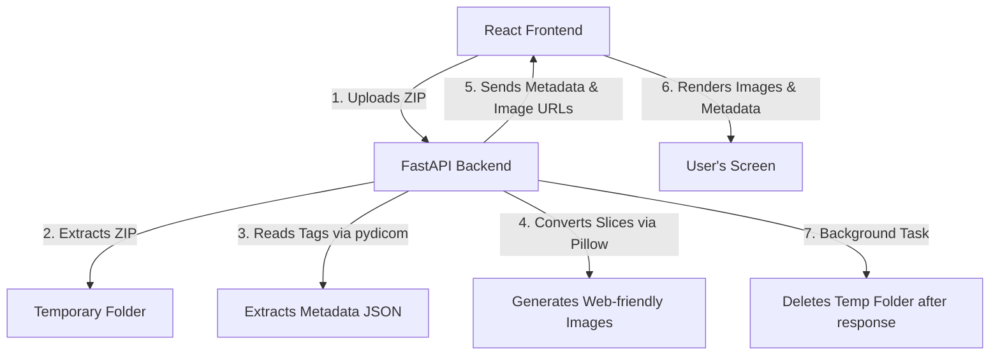

# Implementation Plan - Temporary Python Backend for MedView

We will build a stateless, database-free Python backend using **FastAPI**. It will process uploaded DICOM ZIP files, extract metadata, convert slices into browser-viewable formats (like PNG/JPEG) in a temporary directory, and clean them up automatically once processed or downloaded.

## Proposed Architecture

---

## User Review Required

> [!IMPORTANT]
> **No Database Storage**: No patient data or DICOM studies will be stored permanently on the server. All uploaded files will be stored in a temporary directory (`tempfile.mkdtemp()`) and will be deleted immediately using FastAPI's `BackgroundTask` once the response is sent or the converted file is downloaded.
> This guarantees high security, privacy, and zero database storage costs.

---

## Proposed Changes

### Backend Component

#### [NEW] [requirements.txt](file:///e:/Kishan/Medview-main/backend/requirements.txt)
Python dependencies required for DICOM processing and FastAPI:
* `fastapi`
* `uvicorn[standard]`
* `pydicom`
* `pillow` (PIL) for image conversion
* `python-multipart` (for file uploads)

#### [NEW] [main.py](file:///e:/Kishan/Medview-main/backend/main.py)
* **`/api/upload` endpoint**: Receives the DICOM ZIP, extracts it to a temp folder, parses the DICOM headers using `pydicom`, converts the pixel slices to PNGs, and returns the JSON metadata list + image links.
* **`/api/images/{temp_id}/{filename}` endpoint**: Serves the generated PNG slices.
* **`/api/convert` endpoint**: Converts the DICOM series into a target format (e.g., anonymized ZIP or PNG archive) and offers it for download.
* **Automatic Cleanup**: Uses FastAPI's `BackgroundTask` to clean up the temp directory after a study is processed/downloaded.

---

### Frontend Component

#### [MODIFY] [Viewer.jsx](file:///e:/Kishan/Medview-main/src/pages/Viewer.jsx)
Update the page to connect to the new Python backend instead of using mock images:
* Upload ZIP file to backend.
* Display the series, metadata, and slice frames returned by the Python API.
* Use a loading state during upload and processing.

---

## Verification Plan

### Manual Verification
1. Start the FastAPI backend locally: `uvicorn main:app --reload --port 8000`.
2. Start the React frontend: `npm.cmd run dev`.
3. Upload a sample DICOM ZIP file in the React frontend.
4. Verify that:
   * Slices are extracted and rendered in the viewer panels.
   * Metadata is loaded in the sidebar.
   * Temporary directories on the Python backend are automatically deleted after the upload response is sent or after session completion.
